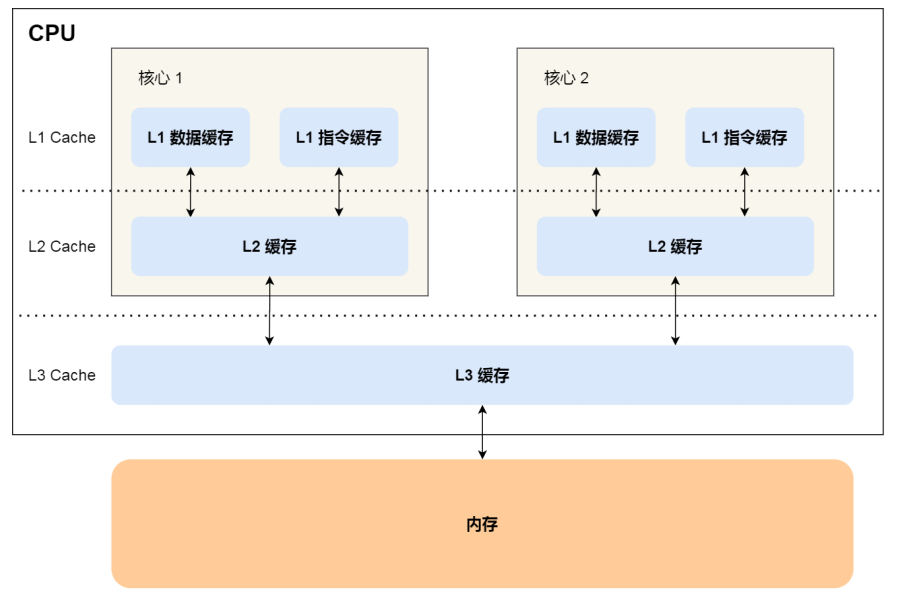
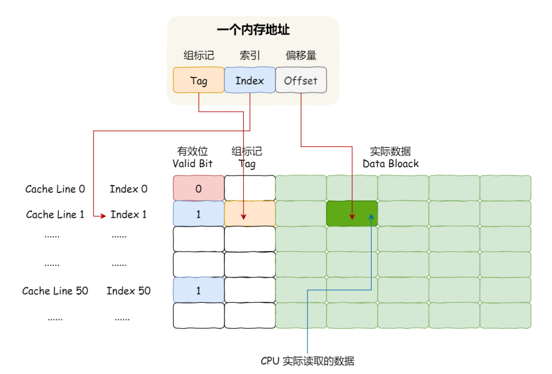
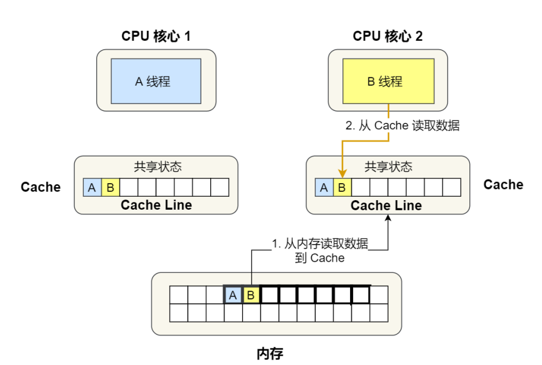
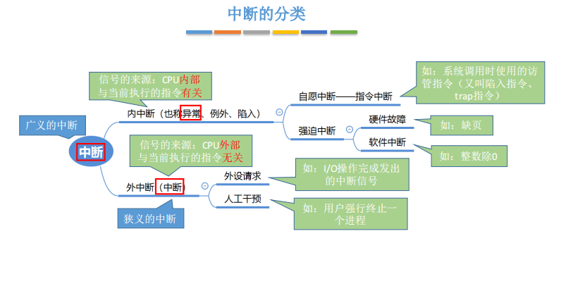
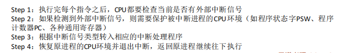
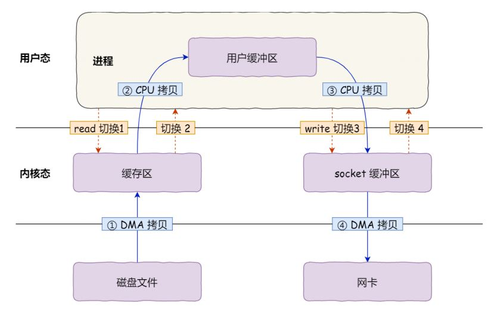
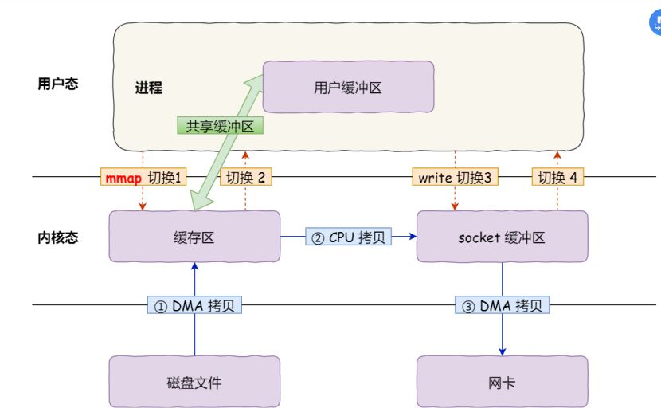
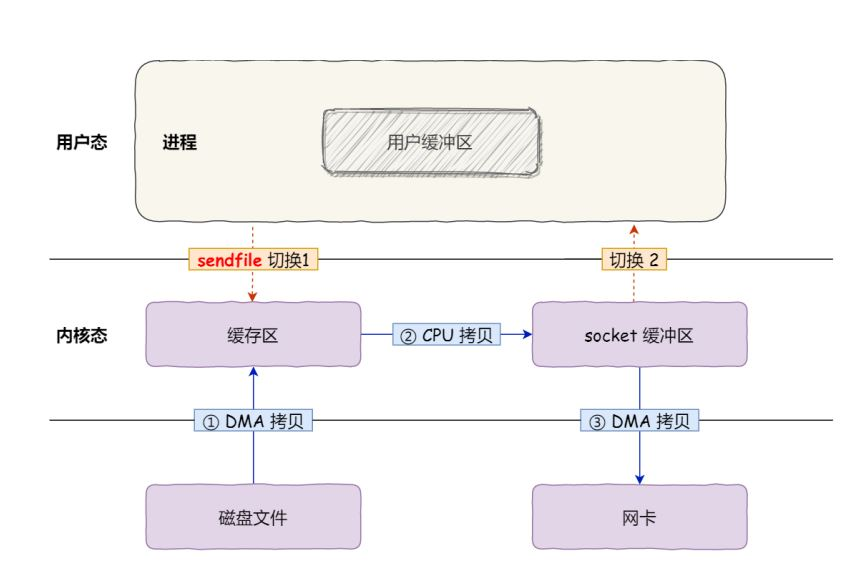
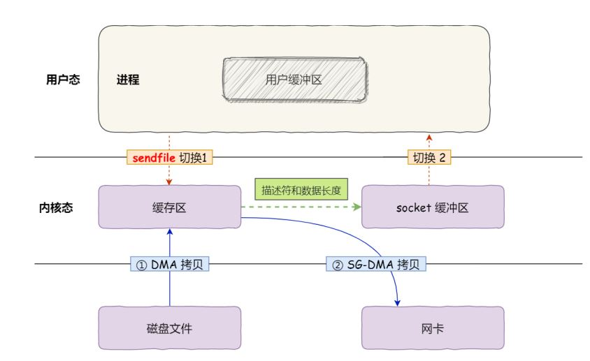

##  一 操作系统基础

### 什么是操作系统？

一个系统软件；

管理整个计算机系统的硬件和软件资源；

作为最接近硬件的层次，对硬件进行了扩展，并屏蔽了物理细节；

为用户或软件提供接口；

### 计算机有哪几部分组成

运算器、控制器、内存、输入输出设备、总线

### 操作系统有哪几部分组成

进程、线程管理；存储器管理；文件管理；输入输出系统；操作系统接口

### 总线

CPU和内存以及其它设备之间的通信，分为地址总线、数据总线、控制总线；

### 线路位宽与CPU位宽

前者：地址的每一位通过一条总线并行传送，32位由32条总线并行传送。

后者：CPU一次能够计算多少字节数据，32位CPU一次可以计算4个字节（2个64位相加需要拆成，高低两次加），最大寻址空间为2的32次方。只有运算⼤数字的时候，64*位 CPU 的优势才能体现出来，否则和 32 位 CPU 的计算性能相差不⼤。

### 软件的位数

64 位和 32 位软件，实际上代表指令是 64 位还是 32 位的；

如果 32 位指令在 64 位机器上执⾏，需要⼀套兼容机制，就可以做到兼容运⾏了。但是如果 64 位指令在 32 位机器上执⾏，就⽐较困难了，因为 32 位的寄存器存不下 64 位的指令；

### 指令周期

取出一条指令并执行这条指令的时间；

取得指令：控制器操作 指令 取到 指令寄存器 中；

执行：控制器进行指令译码；运算器进行运算，或者在控制器中无条件地址跳转；

​	在微程序控制器中，一条指令相当于一个微程序，对应一系列微指令，根据指令以及控制器的地址转移逻辑以	及一系列的状态条件，在控制存储器中找到微指令，微指令通过控制部件向其它部件发出微命令，指挥其它部	件工作。

​	在硬连线控制器中，不存在控制存储器，输入指令以及状态条件，通过逻辑电路，得到微命令。

### 时钟周期

每⼀次脉冲信号⾼低电平的转换就是⼀个时钟周期

CPU的1GHz表示的是1秒产生1G次数的脉冲信号，为时钟周期的倒数；

### 如何让程序更快

程序执行的CPU时间 = 指令数 * 每条指令的平均时钟周期数 * 时钟周期时间

### 存储器层次

L1Cache之上还有寄存器；

每一层存储器之和相邻的一层存储器打交道；

内存之所以比Cache快，是因为

1.Cache离CPU更近；

2.Cache使用的是SRAM，内存用的是DRAM。

前者用一个记忆电路，通过高电平、低电平来保存每一位的状态，

后者用电容器来保存，充满电表示1，放完电表示0；由于电容会漏电，因此要定时刷新电容，防止数据丢失；数据访问电路和刷新电路更复杂；

### cache是什么

Cache是高速缓存，是介于中央处理器和主存储器之间的小容量高速的存储器；弥补主存和CPU之间的速度差异。

直接映射 将一个主存块 存储到唯一一个cache行，多个主存块对一个cache行；访问数据时只需要检查组标记是否相等，缺点是命中率低；

全相连映射 将一个主存块存储到任意一个cache行，一个cache行对多各主存块；命中率高，缺点是每次访问都要与全部内容比较；

组相连映射 可以将一个主存块存储到唯一一个cache组的任意一行；防止了cache全部内容的扫描，同时有效利用cache；

[(107条消息) 容易理解的计算机组成原理中主存与Cache的3种映射方式（直接映射，全相联映射，组相联映射）_叶孤崖的博客-CSDN博客_组相联映射方式](https://blog.csdn.net/qq_34246965/article/details/116458857)

### 与buffer的区别

[(109条消息) Cache与Buffer的区别_自知自省的博客-CSDN博客_buffer和cache区别](https://blog.csdn.net/lijingjingchn/article/details/114540187)

### 局部性原理

程序访问的局部性：

时间局部性：最近被访问的数据在很短的时间内还会被访问；

空间局部性：当前正在被访问的内存的临近的内存区域很快也会被访问。

### 提高缓存命中率

数据缓存：遍历数组的情况时，按照内存布局顺序访问，可以提高命中率

指令缓存：CPU存在分支预测器，根据历史数据，预测将要执行的分支，提前把指令放到指令缓存中

多核的情况：进程可能在不同CPU核心切换执行，可以把线程绑定在一个CPU核心上。

### 内存和Cache的一致性（单核）

- 写直达：把数据同时写入内存和Cache中
  - 如果数据已经在Cache里面，先将数据更新到 Cache里面，再写入到内存里面
  - 如果数据没有在Cache里面，就直接把数据更新到内存里面。

- 写回：写操作时，新的数据仅仅被写入Cache Block（缓存块）里，只有当修改过的 Cache Block （被替换）时才需要写到内存中。
  - 如果发生写操作时，数据已经在缓存块里，则把数据更新到缓存块，同时把这个缓存块标记为脏
  - 如果发生写操作时，数据所对应的缓存块中存放的是别的内存地址的数据，就得检查该缓存块是不是脏的。如果是的，就把这个缓存块的数据写回内存，然后把要写的数据写入该缓存块中，同时标记为脏；如果不是，直接把数据写入该缓存块，然后再把该缓存块标记为脏就行了。

### 多核的缓存一致性

问题：A核心更新了缓存，还没刷入内存，B从内存中拿到久的值；

需要满足亮点：

- 写传播：某个CPU核心里的Cache数据更新时，必须要传播到其他核心的Cache
- 事务串行化：某个CPU核心里对数据的操作顺序，必须在其他核心看起来的顺序是一样的

基于总线嗅探的MESI协议解决了这个问题

### 伪共享

线程1和2交替修改变量A和B，虽然 A 和 B 之间其实并没有任何的关系，但是因为同时归属于⼀个 Cache Line ，这个 Cache Line 中的任意数据被修改后，都会导致整个Cache行失效；

### 为什么负数要用补码表示

如果负数不是使⽤补码的⽅式表示，则在做基本对加减法运算的时候，还需要多⼀步操作来判断是否为负

数，如果为负数，还得把加法反转成减法，或者把减法反转成加法；

⽽⽤了补码的表示⽅式，对于负数的加减法操作，实际上是和正数加减法操作⼀样的

### 计算机怎么存带小数点的数

首先将它转换为2进制，然后规格化，表示成

### 为什么0.1+0.2！=0.3

因为有的小数没办法用2进制来表示，因此存储的实际上是它的近似值

## **二 进程与线程**

### 进程与线程的由来

并发时要保存原有状态，于是有进程；

多核并行时，如果多个进程在多核中反复切换，开销大，于是引入了线程，就是这个进程的某个地方阻塞了，但是进程的其它地方可以运行，不用切换进程；

### 线程的实现

内核线程：由内核实现与管理的线程（线程创建、销毁、切换需要系统调用），内核通过调度器对线程进行调度，并负责将线程的任务映射到各个处理器上。

轻量级进程：通常意义上的线程，内核线程提供的接口，与其有1对1的关系，主要用于在内核支持用户线程。

用户线程实现：完全建立在用户空间的线程库上，系统内核不能感知线程存在的实现。它也往往被称为协程，同一个轻量级线程中的用户级线程间切换不会陷入内核态，然而一旦一个阻塞，那么整个都会阻塞。Java中不支持协程，每一个thread都是映射到一个内核线程中的。

[Java锁与线程的那些事 (youzan.com)](https://tech.youzan.com/javasuo-yu-xian-cheng-de-na-xie-shi/)

### 进程和线程以及其区别以及其优缺点

进程是具有一定独立功能的程序关于某个数据集合上的一次运行活动,进程是系统进行资源分配的一个独立单位.

线程是CPU调度和分派的基本单位,.线程自己基本上不拥有系统资源,只拥有一点在运行中必不可少的资源(如程序计数器,一组寄存器和栈),但是它可与同属一个进程的其他的线程共享进程所拥有的全部资源.

区别：

并发性： 不仅进程之间可以并发执行，同一个进程的多个线程之间也可以并发执行，但是进程间很少相互影响，多考虑通信。线程间会相互影响，多考虑同步（线程通信可不通过内核直接通信）。

系统开销：

 创建或撤销进程时，系统都要为之分配或回收系统资源，如内存空间，I/O设备等，OS所付出的开销显著大于在创建或撤销线程时的开销，同时，进程切换的开销也远大于同一进程内的线程切换的开销，这是因为1、进程的上下文往往比线程的上下文要多；2、进程中使用TLB来加速页表的查找，一旦进程切换了，页表也随之切换，那么TLB就会全部失效，命中率降低，因此程序会变慢，线程切换不会导致TLB失效

线程间数据传递不需要经过内核，开销小

[关于进程和线程---对比--切换开销 - 简书 (jianshu.com)](https://www.jianshu.com/p/37bf161ed5a8)

优缺点：

​	线程：

- 优点：可以提高系统的并行性，数据共享比较方便，切换比较快。

- 缺点：没有内存隔离，一个线程的崩溃会导致整个进程的崩溃。编程复杂以及调试困难。

​	进程：	

- 优点：内存隔离，单个进程的崩溃不会导致这个系统的崩溃。而且进程方便测试以及编程简单

- 缺点：创建销毁比较麻烦，进程间数据的共享麻烦，并且消耗的资源比较多。

### 请描述进程的三种基本状态

- 就绪状态：当进程已分配到除CPU以外的所有必要的资源，只要获得处理机便可立即执行，这时的进程状态称为就绪状态
- 执行状态：当进程已获得处理机，其程序正在处理机上执行，此时的进程状态称为执行状态。
- 阻塞状态：正在执行的进程，由于等待某个事件发生而无法执行时，便放弃处理机而处于阻塞状态。例如，等待I/O完成、申请缓冲区不能满足、等待信件(信号)等。
- 为了满足PCB对数据以及操作的完整性和管理的灵活性，又引入了创建状态和终止状态
- 创建状态：进程所需的资源不能得到满足（如操作系统没有足够的内存将进程装入），此时创建工作没完成，进程不能被调度，处于创建状态。
- 终止状态：进程到达自然结束点或被操作系统终结或被其它有终止权的进程终结，则进程进入终止状态，此时进程不能再执行，但在操作系统中仍保留一个记录，供其它进程进行信息收集，完成信息提取后，操作系统将删除这个进程，也就是将其PCB删除。
- 挂起状态：进程没有占⽤实际的物理内存空间的情况。被阻塞状态的进程占⽤着物理内存就⼀种浪费物理内存的⾏为，在虚拟内存管理的操作系统中，通常会把阻塞状态的进程的物理内存空间换出到硬盘，等需要再次运⾏的时候，再从硬盘换⼊到物理内存。

### 协程是什么

线程创建的几个执行体，申请一些内存给他们用作执行栈，线程按需调度这几个执行体。协程只有用户栈，不会在用户栈和内核栈进行切换，操作系统对协程一无所知，只需要用户进行调用，因此也不存在上下文切换的开销。协程可以在线程中异步执行，没有同步开销。协程还可以保留每一次运行后的状态，重入时从上一次状态开始运行。

### 一个进程里包含什么？

- 一个进程由三部分组成：程序、数据及进程控制块(PCB)。进程控制块是记录进程有关信息的一块主存，是进程存在的程序唯一标识。

- PCB有什么？

  **进程描述信息：**

  进程标识符：标识各个进程，每个进程都有⼀个并且唯⼀的标识符；

  ⽤户标识符：进程归属的⽤户，⽤户标识符主要为共享和保护服务；

  **进程控制和管理信息：**

  进程当前状态，如 new、ready、running、waiting 或 blocked 等；

  进程优先级：进程抢占 CPU 时的优先级；

  **资源分配清单：**

  有关内存地址空间或虚拟地址空间的信息，所打开⽂件的列表和所使⽤的 I/O 设备信息。

  **CPU** **相关信息：**

  CPU 中各个寄存器的值，当进程被切换时，CPU 的状态信息都会被保存在相应的 PCB 中，以便进程重新执⾏时，能从断点处继续执⾏。

- PCB的组织方式：链表，相同状态的进程链到一起；索引方式，同一状态的进程组织在一个索引表中，索引表项指向PCB；进程状态频繁变化，链表的方式更灵活

### 进程的控制（不用细看）

小林coding 152

### 什么时候适合用多线程什么时候适合用多进程？

- 1、需要频繁创建销毁的优先使用线程；因为创建和销毁一个进程代价是很大的。
- 2、线程的切换速度快，所以在需要大量计算，切换频繁时用线程，还有耗时的操作使用线程可提高应用程序的响应；
- 3、需要更稳定安全时，适合选择进程；需要速度时，选择线程更好。因为没有内存隔离，一个线程的崩溃会导致整个进程的崩溃。
- 4、强相关处理用线程，弱相关处理用进程。一般的server需要完成的任务如下：消息接发和消息处理。接发消息和消息处理就是弱相关任务，而消息处理里面又能分为消息解码，业务处理，这两个任务相对来说相关性强很多，因此，消息接发和消息处理可以分进程设计，消息解码和业务处理可以分线程设计。
- 5、可能扩展到多机分布的用多进程，多核分布用多线程。

### 什么是进程间通信？

进程通信：每个进程的⽤户地址空间都是独⽴的，⼀般而⾔是不能互相访问的，但内核空间是每个进程都共享的，所以进程之间要通信必须通过内核。

### 进程间的通信常见的的有哪几种方式呢?最快的是哪种

1. **管道/匿名管道(Pipes)** ：半双工的通信方式，数据只能单向流动，用于具有亲缘关系的父子进程间或者兄弟进程之间的通信。以只存在于内存中的文件存在。
2. **有名管道(Names Pipes)** : 匿名管道由于没有名字，只能用于亲缘关系的进程间通信。为了克服这个缺点，提出了有名管道。有名管道以磁盘文件的方式存在，可以实现本机任意两个进程通信。
3. **信号(Signal)** ：信号是一种比较复杂的通信方式，用于通知接收进程某个事件已经发生；
4. **消息队列(Message Queuing)** ：消息队列是消息的链表,具有特定的格式,存放在内存中并由消息队列标识符标识。管道和消息队列的通信数据都是先进先出的原则。与管道不同的是消息队列存放在内核中，只有在内核重启或者显式地删除一个消息队列时，该消息队列才会被真正的删除。消息队列可以实现消息的随机查询,消息不一定要以先进先出的次序读取,也可以按消息的类型读取.比 FIFO 更有优势。**消息队列克服了信号承载信息量少，管道只能承载无格式字 节流以及缓冲区大小受限等缺点。**
5. **信号量(Semaphores)** ：信号量是一个计数器，用于多进程对共享数据的访问，信号量的意图在于进程间同步。这种通信方式主要用于解决与同步相关的问题并避免竞争条件。
6. **共享内存(Shared memory)** ：使得多个进程可以访问同一块内存空间，不同进程可以及时看到对方进程中对共享内存中数据的更新。这种方式需要依靠某种同步操作，如互斥锁和信号量等。可以说这是最有用的进程间通信方式。
7. **套接字(Sockets)** : 此方法主要用于在客户端和服务器之间通过网络进行通信。与其他通信机制不同的是，它可用于不同机器间的进程通信。套接字通信又分为网络套接字和Unix域套接字，前者可用于多机进程，后者只能用于在同一个计算机的进程间进行通信，由于少了网络协议栈中的校验和计算，删除报文头等复杂操作，其效率更高。

- 最快的方式是共享内存：采用共享内存通信的一个显而易见的好处是效率高，因为进程可以直接读写内存，而不需要任何数据的拷贝。对于像管道和消息队列等通信方式，则需要在内核和用户空间进行四次的数据拷贝。https://blog.csdn.net/gaoyi221119/article/details/75968027

### JAVA线程通信的几种方式

### 进程间的关系可以分为

1. 资源共享关系：系统中某些进程需要访问共同的资源，即当一个进程访问共享资源时，其他访问该共享资源的进程必须等待，当前进程使用结束后，其他进程差才能使用，这时需要互斥地访问共享资源。
2. 相互合作关系：系统中某些进程之间存在相互合作的关系，即当一个进程执行完成后，另一个进程才能开始，否则另外一个进程不能开始，这时就要保证相互合作的进程在执行次序上要同步。

### 信号量与管程

- 信号量由一个整型变量和两个原子操作PV组成，分为整形信号量和记录型信号量，前者在P操作中自旋直到大于0，后者遵循"让权等待"，引入了阻塞队列，P操作中先--，如果小于0就把自己阻塞到队列中，V操作先++，如果大于0，就从阻塞队列中唤醒一个。还有AND型信号量和信号量集，都是基于记录型信号量的，前者将所需要的资源在一次P操作中分配，在一次V操作中释放，但是每种资源一次只能分配或释放1个，后者能一次操作中指定每种资源的数量。

- 管程：信号量操作中，核心操作P-V分散在各用户程序的代码中，不易控制和管理，因此出现管程，他是由代表共享资源的数据结构以及由对该共享数据结构实施操作的一组过程所组成的资源管理程序共同构成了一个操作系统资源管理模块。任一时刻只有一个线程执行管程代码，通过条件变量，正在管程中的线程可临时放弃管程的互斥访问，等待事件出现时再恢复管程的使用。

### 进程同步的方式有哪些？

互斥量、信号量、管程和进程间通信

### 线程同步的方式有哪些？

1.事件: 用来通知线程有一些事件已发生，从而启动后继任务的开始。

​		优点：事件对象通过通知操作的方式来保持线程的同步，并且可以实现不同进程中的线程同步操作。

2.临界区：通过对多线程的串行化来访问公共资源或一段代码，保证在某一时刻只有一个线程能访问数据

​		优点：速度快，简单

​		缺点：虽然临界区同步速度很快，但却只能用来同步本进程内的线程，而不可用来同步多个进程中的线		程。

3.互斥量：为协调共同对一个共享资源的单独访问而设计的。互斥量跟临界区很相似，比临界区复杂，互斥对象只有一个，只有拥有互斥对象的线程才具有访问资源的权限。

​	优点：不仅仅能够在同一应用程序不同线程中实现资源的安全共享，而且可以在不同应用程序的线程之间实	现对资源的安全共享。

​	缺点：

​	①互斥量是可以命名的，也就是说它可以跨越进程使用，创建互斥量需要的资源更多。

​	②通过互斥量可以指定资源被独占的方式使用，但如果有下面一种情况通过互斥量就无法处理，比如现在一	位用户购买了一份三个并发访问许可的数据库系统，可以根据用户购买的访问许可数量来决定有多少个线程/	进程能同时进行数据库操作，这时候如果利用互斥量就没有办法完成这个要求，而应该使用信号量。

4.信号量:为控制一个具有有限数量用户资源而设计。它允许多个线程在同一时刻访问同一资源，但是需要限制在同一时刻访问此资源的最大线程数目。互斥量是信号量的一种特殊情况，当信号量的最大资源数=1就是互斥量了。

​	优点：适用于对Socket（套接字）程序中线程的同步。（例如，网络上的HTTP服务器要对同一时间内访问同	一页面的用户数加以限制，只有不大于设定的最大用户数目的线程能够进行访问，而其他的访问企图则被挂	起，只有在有用户退出对此页面的访问后才有可能进入。）

​	缺点：

​	①信号量机制必须有公共内存，不能用于分布式操作系统，这是它最大的弱点；

​	②信号量机制功能强大，但使用时对信号量的操作分散， 而且难以控制，读写和维护都很困难，加重了程序	员的编码负担；

​	③核心操作P-V分散在各用户程序的代码中，不易控制和管理，一旦错误，后果严重，且不易发现和纠正。

[(92条消息) 进程同步的四种方法_zxx901221的专栏-CSDN博客_进程同步的方式](https://blog.csdn.net/zxx901221/article/details/83006453)

### 什么是临界区

临界区指的是一个访问共用资源的程序片段（例如：共用设备或是共用存储器），而这些共用资源具有无法同时被多个线程访问的特性， 因此当有线程进入临界区段时，其他线程必须等待。

### 互斥体和临界区的区别

- 1、临界区只能用于对象在同一进程里线程间的互斥访问；互斥体可以用于对象进程间或线程间的互斥访问。
- 2、临界区是非内核对象，只在用户态进行锁操作，速度快；互斥体是内核对象，在核心态进行锁操作，速度慢。
- 3、临界区和互斥体在Windows平台都下可用；Linux下只有互斥体可用
- 4、互斥量是可以命名的，它可以跨越进程使用。所以创建互斥量需要的资源更多

### 进程的调度算法（X）

**先到先服务(FCFS)调度算法** : 从就绪队列中选择一个最先进入该队列的进程为之分配资源，使它立即执行并一直执行到完成或发生某事件而被阻塞放弃占用 CPU 时再重新调度。

**短作业优先(SJF)的调度算法** : 从就绪队列中选出一个估计运行时间最短的进程为之分配资源，使它立即执行并一直执行到完成或发生某事件而被阻塞放弃占用 CPU 时再重新调度。

**时间片轮转调度算法** : 时间片轮转调度是一种最古老，最简单，最公平且使用最广的算法，又称 RR(Round robin)调度。每个进程被分配一个时间段，称作它的时间片，即该进程允许运行的时间。

**多级反馈队列调度算法** ：前面介绍的几种进程调度的算法都有一定的局限性。如**短进程优先的调度算法，仅照顾了短进程而忽略了长进程** 。多级反馈队列调度算法既能使高优先级的作业得到响应又能使短作业（进程）迅速完成。

​	设置多个就绪队列，每个赋予不同的优先级，优先级越高的队列，时间片越小，在最后一个队列按RR方式	运行；

​	第一个队列时间片略大于人机交互需要的时间。

**优先级调度** ： 为每个流程分配优先级，首先执行具有最高优先级的进程，依此类推。最高优先级算法可与不同的CPU方式结合形成可抢占式最高优先级算法和不可抢占式最高优先级算法。

### 进程fork()的写时复制，fork与vfork的区别

fork创建子进程的时候，系统为了减少损耗，并不是一开始就复制了一份物理内存给子进程，而是复制了一份虚拟地址给子进程，父子进程的虚拟地址映射到相同的物理地址。该物理地址被标记为只读。当系统需要对该地址进行写的时候，此时系统才会把修改的数据页复制给子进程，然后他们各自的物理地址被标记为可写。

当使用exec函数时，当前的进程的正文、堆栈等完全被程序替换。

而对于vfork，子进程都不用复制，直接和父进程共享虚拟地址数据段。因此每一时刻只能运行一个进程，vfork规定必须子进程先运行，直到它调用exec函数创建新程序或者_exit()函数退出，否则会发生死锁。正常退出不要用return退出，否则报错。其主要目的是创建一个和父进程不同的新程序。所以省掉了复制。如果采用vfork，尽量立刻执行exec。vfork产生的原因就是为了子进程可以执行新的程序。

### 进程的上下文是什么？

进程上下文实际上是进程执行活动全过程的静态描述。进程的上下文：用户级上下文（地址空间中的程序块，数据块，用户栈 ），系统级上下文（PCB、内核栈等），寄存器上下文（各寄存器的值）。

### 什么时候发生进程调度

进程主动放弃CPU：进程正常终止；运行过程中发生异常而终止；主动请求阻塞（等待IO）

被动放弃CPU：时间片用完；外界中断；高优先级进程抢占

### 什么时候不能发生调度

处理中断的过程中；进程在操作系统内核的临界区中；原子操作过程中

### 讲一下进程间的上下文的切换？

1.进程上下文切换需要系统调用，会陷入内核态，因此首先SP寄存器的指针（指向用户栈）保存到内核栈里边，令他指向内核栈，然后把各寄存器的值保存到内核栈里边，同时SP寄存器的值保存在PCB中；

2.把该进程的PCB的状态位从运行态修改为其他就绪态或者阻塞态。

3.把切换后的进程的PCB的加入运行队列，并修改状态为为运行态。

4.从切换后进程的PCB中，通过PCB中SP的值对内核栈弹出，恢复各寄存器的值，最后SP寄存器指向用户栈。

5.最后，进程切换与普通的系统调用陷入内核态的区别在于，进程切换后由于虚拟内存的切换，因此页表也随之切换，TLB就失效了，缓存命中率大大降低，需要重新构建TLB

（进程上下文切换需要系统调用，会陷入内核态，因此首先SP寄存器的指针（指向用户栈）保存到内核栈里边，而由于进程切换需要保存硬件上下文，因此会把各寄存器的值保存到内核栈里边，同时SP寄存器的值保存在PCB中；当发生切换回当前进程的时候，通过SP寄存器的值对内核栈弹出，恢复各寄存器的值，最后SP寄存器指向用户栈）

（内核栈进去都是空的，[(100条消息) Linux下PCB(进程控制块)、内核栈和用户空间栈关系_mm_hh的博客-CSDN博客](https://blog.csdn.net/mm_hh/article/details/70056519/)）

### 线程的上下文切换

当两个线程是属于同⼀个进程，共享进程中的资源（比如虚拟内存、全局变量），只需要切换线程的私有数据、寄存器等不共享的数据。

### 什么是守护线程

守护线程，专门用于服务其他的线程，比如GC线程。jvm会等待非守护进程完成后关闭，而守护进程随着jvm的关闭而关闭。

## 三 锁

### 死锁的定义

- 死锁是指两个或两个以上的进程在执行过程中，由于竞争资源或者由于彼此通信而造成的一种阻塞的现象，若无外力作用，它们都将无法推进下去。此时称系统处于死锁状态，这些在互相等待的进程称为死锁进程。

### 死锁的四个必要条件

- - 互斥条件：一个资源一次只能被一个进程使用

  - 请求与保持条件：一个进程因请求资源而阻塞时，对已获得资源保持不放

  - 不可剥夺条件：进程获得的资源，在未完全使用完之前，不能强行剥夺

  - 循环等待条件：若干进程之间形成一种头尾相接的环形等待资源关系

### 死锁避免

安全状态是指系统能按某种顺序来为每个进程分配其所需资源（安全序列），直到最大需求，使每个进程都可顺序完成。若系统不存在这样一个安全序列，则称系统处于不安全状态。

系统对进程发出每一个系统能够满足的资源申请进行动态检查，并根据检查结果决定是否分配资源，如果分配后系统进入不安全状态，则不予分配，否则予以分配。这是一种保证系统不进入死锁状态的动态策略。

### 银行家算法

### 死锁预防

死锁预防：只要打破四个必要条件之一就能有效预防死锁的发生：

- 打破互斥条件： 互斥条件是非共享设备必须的，不仅不能改变，还应保证。
- 打破请求与保持条件： 采用资源预先分配策略，即进程运行前申请全部资源，满足则运行，不然就等待。
- 打破不可抢占条件： 当一进程占有一独占性资源后又申请一独占性资源而无法满足，则退出原占有的资源。
- 打破循环等待条件： 实现资源有序分配策略，对所有设备实现分类编号，所有进程只能采用按序号递增的形式申请资源。

### 死锁避免与死锁预防的区别：

- 死锁预防是设法至少破坏产生死锁的四个必要条件之一，严格的防止死锁的出现；而死锁避免则不那么严格的限制产生死锁的必要条件的存在，因为即使死锁的必要条件存在，也不一定发生死锁。死锁避免是在系统运行过程中注意避免死锁的最终发生。

### 认识哪些锁？

互斥锁、⾃旋锁、读写锁、乐观锁、悲观锁

1、互斥锁：加锁失败后，会从⽤户态陷⼊到内核态，让内核帮我们切换线程，让出 CPU，因此会有两次线程上下⽂切换的成本

2、⾃旋锁：加锁失败后，线程会忙等待，直到它拿到锁。自旋锁是通过 CPU 提供的 CAS 函数，在「⽤户态」完成加锁和解锁操作，不会主动产⽣线程上下⽂切换，⼀般加锁的过程，包含两个步骤：

第⼀步，查看锁的状态，如果锁是空闲的，则执⾏第⼆步；

第⼆步，将锁设置为当前线程持有；

CAS 函数就把这两个步骤合并成⼀条硬件级指令，形成原⼦指令，这样就保证了这两个步骤是不可分割

的，要么⼀次性执⾏完两个步骤，要么两个步骤都不执⾏。

3、读写锁：当写锁没有被线程持有时，多个线程能够并发地持有读锁，但是，⼀但写锁被线程持有后，读线程的获取读锁的操作会被阻塞，⽽且其他写线程的获取写锁的操作也会被阻塞。适用于读多写少。

4、悲观锁：是一种独占锁，访问共享资源前，先要上锁。

5、乐观锁：先修改完共享资源，再验证这段时间内有没有发⽣冲突，如果没有其他线程在修改资源，那么操作完成，如果发现有其他线程已经修改过这个资源，就放弃本次操作。一般结合版本号使用。适用于加锁成本高，冲突概率低的情况。

### 读写锁的优先级

读优先：当读线程 A先持有了读锁，写线程 B 在获取写锁的时候，会被阻塞，并且在阻塞过程中，后续来的读线程 C 仍然可以成功获取读锁，最后直到读线程 A 和 C 释放读锁后，写线程 B 才可以成功获取写锁。

写优先：当读线程 A 先持有了读锁，写线程 B 在获取写锁的时候，会被阻塞，并且在阻塞过程中，后续来的读线程 C 获取读锁时会失败，于是读线程 C 将被阻塞在获取读锁的操作，这样只要读线程 A 释放读锁后，写线程 B 就可以成功获取读锁。

二者都会产生饥饿

解决：

公平读写锁：⽤队列把获取锁的线程排队，不管是写线程还是读线程都按照先进先出的原则加锁即可，这样读线程仍然可以并发，也不会出现「饥饿」的现象。

读优先，但是用信号量控制读的个数。

### 生产者消费者模型

wait不能交换，否则会死锁

## 四 内存管理

### 程序编译链接的几个步骤：

预处理；

编译：对源程序编译，形成目标模块；

汇编：将目标模块中的汇编代码，转换成机器指令

链接：链接程序将编译后的目标模块以及所需要的库函数链接起来，形成一个装入模块；

- 静态链接：装入前就把各目标模块与所需的库函数链接成一个完整的装入模块，以后不再拆开；
- 装入时动态链接：装入内存时边装入边链接，相对于静态链接，优点是：前者如果要修改其中某个模块，则需要重新打开装入模块，而后者由于目标模块分开存放，修改容易实现；
- 运行时动态链接：把对模块的链接推迟到程序执行时才进行，这是因为每次运行用到的模块可能是不相同的，有些模块在运行时可能不会用到。

装入：将装入模块装入内存；

- 绝对装入：编译后的目标模块中的地址是绝对地址；
- 可重定位装入：在装入时，对目标程序中的相对地址一次修改为绝对地址，以后不再改变；
- 动态装入：把目标程序中的相对地址的转换推迟到真正执行时才进行，这支持紧凑与进程的换入换出。

### 连续分配

含义：

为一个用户程序分配一个连续的内存空间，代码或数据的逻辑相邻体现在物理地址的相邻

方式：

​	单一连续分配

​	固定分区分配

​	动态分区分配，为了找出合适的空闲分区，有顺序式搜索法（首次适应、循环首次适应、最佳适应、最坏适应）以及索引式搜索法（快速适应、伙伴系统）

内存会被分配成许多小分区，缺乏大空间，由于需要连续分配，无法装入大的程序，需要进行紧凑（用到了动态重定位技术，即装入内存后的所有地址仍然是逻辑地址，转换推迟到指令真正执行时，用重定位寄存器存储起始地址）

### 分页存储管理

### 分段存储管理

### 段页式存储管理

### 虚拟内存

虚拟内存是计算机系统内存管理的一种技术。它使得应用程序认为它拥有连续可用的内存（一个连续完整的地址空间），而实际上，它通常是被分隔成多个物理内存碎片，还有部分暂时存储在外部磁盘存储器上，在需要时进行数据交换。它使用了内存的分页管理和虚拟存储器；

### 虚拟存储器的定义与特征

虚拟存储器是指具有请求调入功能和置换功能，从逻辑上对内存容量扩充的一种存储器系统；

特征是多次性（程序和数据无需在作业运行时一次装入内存，允许分多次装入）；对换性，程序和数据无须在运行时一直常驻内存，允许在运行过程中换入和换出；虚拟性，从逻辑上扩充了内存容量；

## 五 用户态与内核态

### 什么是系统调用

系统调用是操作系统给用户提供的程序级接口。如果一个用户需要在程序中使用操作系统的服务（比如IO），则只能通过系统调用。系统调用与一般过程调用的主要区别是运行的状态不同。系统调用全部运行在内核态，需要经过陷入，而一般过程调用运行在用户态，调用时直接跳转。

### 为什么要使用系统调用？

OS 为了安全的管理计算机软硬件资源，不允许程序员直接操作系统资源，比如（进程、内存、I/O、文件），因此需要系统调用为用户提供向 OS 请求相关资源的服务。

### 程序员如何使用系统调用，OS 如何响应？

程序员在代码中首先传递系统调用参数，然后由陷入指令（内中断）负责将用户态转换为核心态，并将返回地址压栈备用，然后 CPU 执行相应的内核服务程序，最后返回用户态。

### 用户态和内核态的区别

- - 当一个任务（进程）执行系统调用而陷入内核代码中执行时，我们就称进程处于内核运行态（或简称为内核态）。此时处理器处于特权级最高的（0级）内核代码中执行。当进程处于内核态时，执行的内核代码会使用当前进程的内核栈，也就是堆栈指针寄存器指向内核栈。每个进程都有自己的内核栈。
  - 当进程在执行用户自己的代码时，则称其处于用户运行态（用户态）。即此时处理器在特权级最低的（3级）用户代码中运行，堆栈指针寄存器指向用户栈

### 用户态进入内核态的方式

- -  系统调用：这是用户态进程主动要求切换到内核态的一种方式，用户态进程通过系统调用申请使用操作系统提供的服务程序完成工作，比如fork()实际上就是执行了一个创建新进程的系统调用。而系统调用的机制其核心还是使用了操作系统为用户特别开放的一个中断来实现，例如Linux的int 80h中断。
  -  异常：当CPU在执行运行在用户态下的程序时，发生了某些事先不可知的异常，这时会触发由当前运行进程切换到处理此异常的内核相关程序中，也就转到了内核态，比如缺页异常。
  -  外围设备的中断：当外围设备完成用户请求的操作后，会向CPU发出相应的中断信号，这时CPU会暂停执行下一条即将要执行的指令转而去执行与中断信号对应的处理程序，如果先前执行的指令是用户态下的程序，那么这个转换的过程自然也就发生了由用户态到内核态的切换。比如硬盘读写操作完成，系统会切换到硬盘读写的中断处理程序中执行后续操作等。
  -  这3种方式是系统在运行时由用户态转到内核态的最主要方式，其中系统调用可以认为是用户进程主动发起的，异常和外围设备中断则是被动的。

## 六 其它

### 什么是缓冲区溢出？有什么危害？其原因是什么？

- - 缓冲区溢出是指当计算机向缓冲区填充数据时超出了缓冲区本身的容量，溢出的数据覆盖在合法数据上。

  - 危害有以下两点：

  - - 程序崩溃，导致拒绝服务
    - 跳转并且执行一段恶意代码

  - 原因：程序中没有仔细检查用户输入。

### 什么叫僵尸进程？怎么处理僵尸进程？

- - 定义：完成了生命周期但却依然留在进程表中的进程，我们称之为 “僵尸进程”。
  - 如何产生：当你运行一个程序时，它会产生一个父进程以及很多子进程。 所有这些子进程都会消耗内核分配给它们的内存和 CPU 资源。这些子进程完成执行后会发送一个 Exit 信号然后死掉。这个 Exit 信号需要被父进程所读取。父进程需要随后调用 wait 命令来读取子进程的退出状态，并将子进程从进程表中移除。若父进程正确第读取了子进程的 Exit 信号，则子进程会从进程表中删掉。但若父进程未能读取到子进程的 Exit 信号，则这个子进程虽然完成执行处于死亡的状态，但也不会从进程表中删掉。
  - 处理：向父进程发出SIGCHLD信号，父进程wait子进程，确保删除子僵尸；或者将僵尸进程挂到init进程下，让他处理；

### 孤儿进程

一个父进程退出，而它的一个或多个子进程还在运行，那么那些子进程将成为孤儿进程。孤儿进程将被init进程(进程号为1)所收养，并由init进程对它们完成状态收集工作。

### 各种调度算法

小林codeing

### ASCII、Unicode和UTF-8编码的区别？

ASCII和Unicode是一种符号集，指定了符号与二进制的映射关系，ASCII用来表示英文中的128个符号，为了讲世界上的符号都赋予一个独一无二的二进制编码，所以有了Unicode。

上述两者都只规定了符号的表示，没有规定符号如何存储。

UTF-8是Unicode的实现方式之一，是一种变长的编码格式，从而大大节省空间。

### 大端和小端存储概念

大端存储：数据的高字节保存在内存的低地址中，低字节保存在高地址中；小端存储：数据的高字节保存在内存的高地址中，低字节保存在低地址中。

### Linux的文件描述符

每⼀个进程都有⼀个数据结构 task_struct ，该结构体⾥有⼀个指向进程级文件描述符表的指针，表⾥列出这个进程打开的所有⽂件的⽂件描述符。数组的下标是⽂件描述符，是⼀个整数，⽽数组的内容是⼀个指针，指向系统级的文件打开表中，文件对应的位置，此位置又存储了文件的inode等信息，通过inode可以访问到文件的数据。进程每打开一个文件，内核就会向进程返回对应的文件描述符。

### CPU的超线程技术

两个线程可以在一个CPU中并行执行，它们利用CPU中不同的部分，但是当需要同一个资源的使用，其中一个线程需要让出来；

### 如何查看线程占用资源

top和ps都有 -H参数能够查看线程

## 七 输入输出系统

##### 设备控制器（硬件层）

为了屏蔽设备之间的差异，每个设备都有⼀个设备控制器，它有三类寄存器，分别是状态寄存器、 命令寄存器以及数据寄存器。块设备由于数据量非常大，于是设立了一个可读写的数据缓冲区。

##### 块设备和字符设备

块设备，把数据存储在固定⼤⼩的块中，每个块有⾃⼰的地址，随机读取，硬盘、USB 是常⻅的块设备。

字符设备，以字符为单位发送或接收⼀个字符流，字符设备是不可寻址的，顺序读取，⿏标是常⻅的字符设备。

#####  CPU 是如何与设备的控制寄存器和数据缓冲区进⾏通信的

端口IO（通过特殊指令）；内存映射IO

##### IO控制方式

CPU轮询设备控制器的状态寄存器；

数据准备好后中断，CPU将数据从设备控制器缓冲区拷贝到PageCache，再拷贝到用户缓冲区；

CPU告诉DMA控制器，要读多少个数据放到哪些位置，DMA控制磁盘将缓冲区的数据传输到内核缓冲区，完成后DMA中断CPU，CPU将内核缓冲区的数据拷贝到用户缓冲区（仅传送开始和结束CPU干预）

##### 中断

为了实现并发而提出，发生中断意味着，陷入内核态，操作系统介入工作；

##### 外中断的处理过程

##### 中断向量表

中断程序的入口地址放在中断向量表的一个表项，中断的时候，根据中断号，查中断向量表；

##### pageCache磁盘高速缓存缓存

优点：

缓存最近被访问的数据（时间局部性）；预读功能（空间局部性）

缺点：

不适用于大文件的网络传输；

原因是pageCache长时间被大文件占据，热点小文件无法使用pagecache；大文件传输过程，某部分被再次访问的概率低，pagecache可能不起作用，却耗费DMA多拷贝到pagecache一次；（因此零拷贝不适用于大文件传输）

传输大文件应该用异步IO+直接IO，异步使得传输无阻塞，直接IO不使用pagecache，由于绕过了pagecache，无法享受内核的一些优化（IO调度优化以及预读操作）

#### 键盘敲⼊A 字⺟时，操作系统期间发⽣了什么？

输⼊键盘字符，键盘控制器就会产⽣扫描码数据，缓冲在键盘控制器的寄存器中，紧接着键盘控制器通过总线给 CPU 发送中断请求。CPU 收到中断请求后，操作系统会保存被中断进程的 CPU 上下⽂，然后调⽤键盘的中断处理程序（键盘的中断处理程序是在键盘驱动程序初始化时注册的）。功能是从键盘控制器的寄存器读取扫描码，再根据扫描码找到⽤户在键盘输⼊的字符，如果输⼊的字符是显示字符，那就会把扫描码翻译成对应显示字符的 ASCII 码放到「读缓冲区队列」

接下来，显示设备的驱动程序会定时从「读缓冲区队列」读取数据放到「写缓冲区队列」，最后把「写缓冲区队列」的数据⼀个⼀个写⼊到显示设备的控制器的寄存器中的数据缓冲区，最后将这些数据显示在屏幕⾥。

显示出结果后，恢复被中断进程的上下⽂。

### 八、文件系统（组织和管理存储在磁盘的文件）

**inode索引结点**：文件的唯一标识；记录文件的元信息（数据在磁盘的位置等）

**目录项：**内核会把已经读过的目录用目录项缓存在内存，防止频繁从磁盘读

**虚拟文件系统：**文件系统种类多，需要虚拟文件系统提供一个统一的接口；

磁盘读写单元是扇区（512B）为了提高读写效率，文件系统操作单元是数据块，一次性读写8个扇区；

**软链接：**重新创建一个文件，文件的内容是另外一个文件的路径，可以跨文件系统；

**硬链接：**多个目录项中的文件inode指向同一个inode，inode是文件系统独有的，因此不能跨文件系统；

#### **文件在磁盘上的存储方式**

**连续存放：**文件头指定起始块位置和长度；优点是读写效率高，一次寻道就能读取整个文件；缺点是存在磁盘空间碎片，文件长度不易扩展；

**非连续存放：**

链表方式：

隐式链表，文件头包含第一块和最后一块，每个数据块留出一个指针空间，存放下一个数据块位置，缺点是只能通过指针顺序访问文件，指针消耗空间，一个指针出问题，文件数据会丢失；

显示链表，把⽤于链接⽂件各数据块的指针，显式地存放在内存的⼀张链接表中，该表在整个磁盘仅设置⼀张文件分配表，每个表项中存放链接指针，指向下⼀个数据块号。

索引方式：使用inode，包含多级间接索引；缺点是对于十分小的文件，也需要分配一个inode；

#### **空闲空间的管理**

空闲表法：每一段连续的空闲块在表中占一项，适用于连续分配；

空闲链表法：每个空闲块中存有指向下一个空闲块的指针，缺点是不能随机访问；

位图法：每一位标识一个盘块的使用情况；

#### 文件系统结构

整个文件系统会分为引导块和多个区块群组，每个群组有超级块（整个文件系统的信息），块组描述符（各个块组的状态），数据位图和inode位图，inode表和数据块；（每个群组有重复信息，超级块和块组描述符，这是因为1.提供冗余副本，防止被破坏，2.文件与管理数据接近）

#### 目录

目录也是文件，保存的是目录里面一项项的文件信息，每一项存的是文件名、文件inode等信息；

为了防止一项项地在目录列表中找文件，可以建立哈希表，每一项对应一个哈希值；

### 九、零拷贝

##### 传统的通过网络传输数据：

发生4次拷贝和4次上下文切换；

##### mmap+write，mmap()替换read()

mmap() 系统调⽤函数会直接把内核缓冲区⾥的数据映射到⽤户空间；

需要4次上下文切换+3次拷贝；

##### sendfile

sendfile可以替代read和write；可以减少一次系统调用

需要2次上下文切换+3次拷贝；

##### 网卡⽀持 SG-DMA

两次上下文切换+2次拷贝；

真正的零拷⻉技术：全程没有通过CPU 来搬运数据，所有的数据都是通过DMA 来进⾏传输的。

SG-DMA拷贝由SG-DMA控制器进行，这需要socket缓冲区中，存在缓冲区描述符和数据长度；

