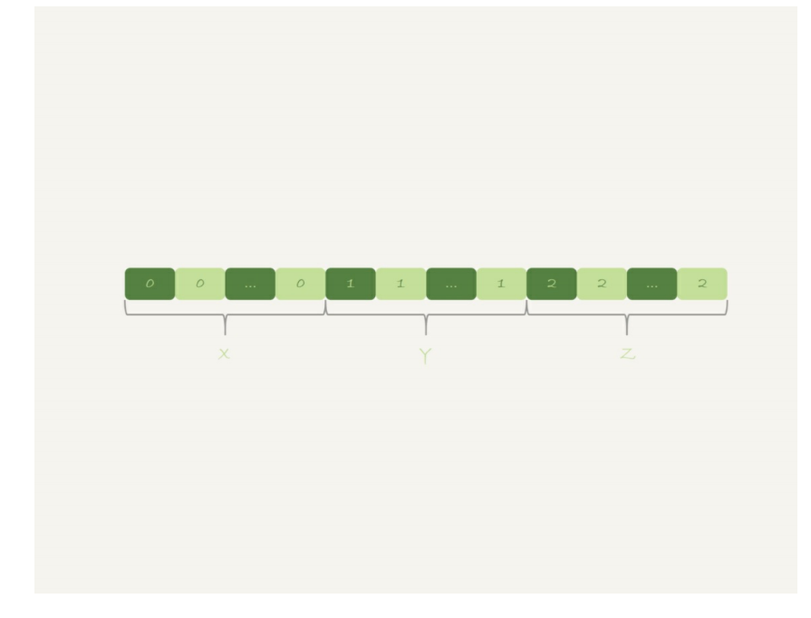

##### group by m

首先创建内存临时表，根据扫描到的数据更新内存临时表中数据，最后将临时表中的数据对字段m进行排序；可以order by null，再最后不进行排序；如果内存临时表不能放下所有数据，那么需要用磁盘临时表；

##### 使用索引优化

根据m字段是有序的，那么就不需要临时表

##### 直接排序

使用SQL_BIG_RESULT提示不适用内存临时表而是直接使用磁盘临时表；

MySQL优化器会优化到使用数组去存储，也就是用sort_buffer，将m与主键放到sort_buffer，扫描完全部后会对sort_buffer进行排序（如果sort_buffer过小，会用到磁盘临时文件）（也是成下面这个样子），最后在去扫描排序后的数据，得到结果集；

