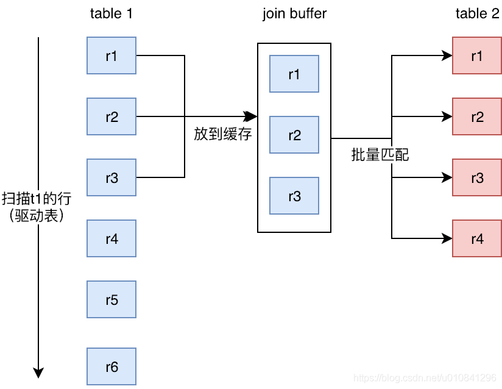

#### 首先要明白：

​	扫描：将数据从磁盘中拿到内存（下面的扫描均假设用完后就从内存移出，且一行行扫描）

​	比较：在内存中进行，耗时相对于扫描而言可以忽略不记。

​	buffer pool：MYSQL 服务器启动的时候向操作系统申请一块连续的内存，通过修改innodb_buffer_pool_size来修改它的大小。

​	驱动表：

​		连接算法的外层循环对应的表；

​		MySQL在决定哪个表作为驱动表的时候，将两个表按照各自的条件过滤（where），过滤完成之后，计算参与 join 的各个字段的总数据量，数据量小的那个表，就是“小表”，应该作为驱动表；

​		可以用STRAIGHT JOIN代替JOIN强制使用左表作为驱动表（只能用于inner join）。

#### 连接的三种算法

**一、Simple Nested-Loop Join**

简单粗暴的嵌套循环，如果table1有10条数据，table2有10条数据，那么扫描行数为10+10*10行，比较的次数为10 * 10 =100次。

**二、Index Nested-Loop Join（连接条件字段有索引）**

外层表直接与内层表索引进行匹配，避免和内层表的每条记录进行比较，减少了扫描行数；

非驱动表的关联键是主键的话，这样来说性能就会非常的高，如果不是主键的话，关联起来如果返回的行数很多的话，效率就会特别的低，因为要多次的回表操作取出其它数据。

**从时间复杂度的角度分析：**

假设被驱动表结果集的行数是 M，索引树是K叉的，驱动表结果集的行数是 N。考虑到要回表拿数据，被驱动表中找一行的复杂度是2*logK(M)（找+拿），则整个过程的复杂度为N + N*2*logK(M)，这比Simple Nested-Loop Join的时间复杂度M*N要好。而且N对结果集的影响非常大，N较小时能得到更小的复杂度，因此应该用**小的结果集驱动大的结果集**。

**三、Block Nested-Loop Join（连接条件字段没有索引，就用这个）**

通过一次性缓存多条数据，把驱动表的参与查询的列缓存到Join Buffer 里，然后拿join buffer里的数据批量与内层表的数据进行匹配（即一次table2的循环就将Join Buffer的里数据匹配完），从而减少了内层循环的扫描行数（为什么减少了？看下面分析）；

Join buffer 的大小是由参数 join_buffer_size 设定的；

Join Buffer会缓存驱动表所有参与查询的列而不是只有Join关联的列，因此使用到的字段越少，join buffer 所缓存的数据就越多，内层表的循环次数就越少；

使用Block Nested-Loop Join算法需要开启优化器管理配置的optimizer_switch的设置block_nested_loop为on，默认为开启；

存在多表连接，一次查询中，可能用到多个Join buffer；

explain中的extra会显示using join buffer;

**从扫描的行数的角度进行分析：**

假设，驱动表的数据行数是 N，需要分 K 段装入join buffer才能完成算法流程，被驱动表的数据行数是 M。N 越大 K 就会越大，可把 K 表示为 α * N，显然 α 的取值范围是 （0，1）。

则执行过程中

1. 扫描行数是 N + α *N* M；
2. 内存判断 N * M 次。

扫描的行数比Simple Nested-Loop Join的N+M*N更小。而且N对结果的影响更大，因此应该使用**小的结果集驱动大的结果集**。

参考：

[MYSQL 连接查询算法：JOIN语句在 MYSQL 内部到底是怎么执行的 - 知乎 (zhihu.com)](https://zhuanlan.zhihu.com/p/187573656)

[(95条消息) 学习Mysql的join算法：Index Nested-Loop Join和Block Nested-Loop Join_Java程序员的进阶之路-CSDN博客](https://blog.csdn.net/u010841296/article/details/89790399)

[MySQL之嵌套循环【Join原理】 - 程序员大本营 (pianshen.com)](https://www.pianshen.com/article/5063298871/)

### JOIN的一些优化

#### NLJ算法的优化：

##### MRR算法

join的时候被驱动表需要一行行地根据主键回表查数据，这样对磁盘的读就是一个随机IO；

优化就是，可以根据辅助索引，将符合条件的数据的主键放入read_md_buffer中，buffer中的数据按照id递增排序，然后根据排序后的id依次回表查，这样就转换成了近似顺序IO；

##### BKA算法

NLJ中，由于对于被驱动表，每一次匹配都是只匹配一个值，无法使用MRR算法优化；

因此可以用join_buffer，存放驱动表的一部分数据，然后与被驱动表进行批量匹配，再使用MRR优化；

#### BNL算法的优化：

BNL算法对系统的影响主要包括三个方面： 

1. 可能会多次扫描被驱动表，占用磁盘IO资源； 

2. 判断join条件需要执行M*N次对比（M、N分别是两张表的行数），如果是大表就会占用非常 

​		多的CPU资源； 

3. 可能会导致Buffer Pool的热数据被淘汰，影响内存命中率：如果被驱动表是一个大的冷数据表，那么会多次扫描到冷数据，冷数据页移到LRU链表的头部，占据buffer pool的yong区，同时淘汰掉刚刚进入old区的热数据页，这样命中率就下降了；

优化：

增大join_buffer_size，减少对冷数据页的扫描次数；

被驱动表连接字段上加索引；

如果被驱动表数据很多，但是参与join数据很少，同时语句是低频的，那么建索引的就很浪费，因此可以把建一个临时表，被驱动表的数据过滤后放入临时表中，为临时表建索引，然后再进行join；

（45讲第35）

