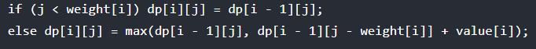
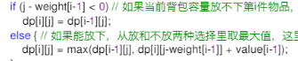

### 回溯篇

去重是在同一层中进行去重；

组合问题：去重可以线先排序，然后用startIndex或者是同一层用一个局部的set；

排列问题：交换；或者是在同一层中遍历全部，需要用全局得set标记是否使用过；去重得话，需要先排序，然后用一个全局的set（[代码随想录 (programmercarl.com)](https://www.programmercarl.com/0047.全排列II.html#_47-全排列-ii)）

子集问题：搜索得是整棵树，而不是像前面两个那样搜索到叶子结点，因此每层递归前都需要将结果放入结果集中，而不是等到到达叶子结点；

### 动规篇

##### 背包问题

**用滚动数组解题时，dp[j]，j表示容量：**

01背包：按照物品-容量的两层for遍历，容量从大到小

完全背包：

​	组合：按照物品-容量的两层for遍历，容量从小到大

​	排列：按照容量-物品的两层for遍历，容量从小到大

**不用滚动数组解题时，dp[i] [j]，i表示前i个数，j表示第i个数**

01背包的转移：

完全背包的转移（注意i的不同）：

（即使for交换也不会影响，因此无法解决排列类的问题）
